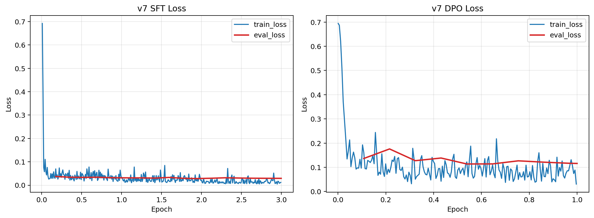
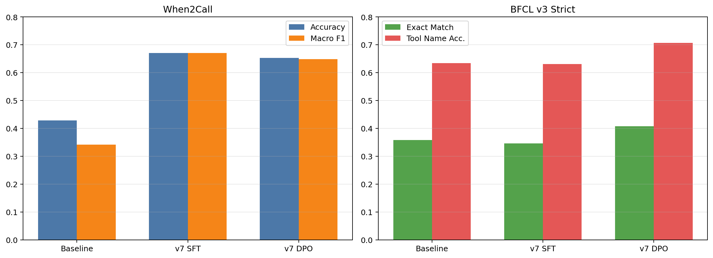

# Qwen2.5-3B Function-Calling Post-Training Experiment

本项目围绕 `Qwen2.5-3B-Instruct` 进行函数调用后训练实验，目标是同时优化两类能力：

- `When2Call`：什么时候该调工具、什么时候该追问、什么时候该拒答
- `BFCL v3 strict`：工具选择、参数填写、多工具调用与 irrelevance 场景下的严格匹配能力

项目中同时搭建了本地评测闭环，包括：

- dataset-driven baseline
- LoRA SFT
- DPO with SFT regularization
- vLLM 批量推理
- 自动化打分与结果对比

## 1. 实验目标

本轮主线实验聚焦 `v7`：

1. 先构造更偏 `BFCL` 的 mixed SFT 数据，对 `Qwen2.5-3B-Instruct` 做 LoRA SFT。
2. 在 `v7 SFT` 基础上，进一步构造 `BFCL-style preference` 数据，做 regularized DPO。
3. 对比 `baseline / v7 SFT / v7 DPO` 在 `When2Call` 与 `BFCL v3 strict` 上的变化，分析能力 trade-off。

## 2. 目录结构

目录：

- [data/raw](/root/home_lcq/data/raw)
  - 原始数据集下载目录，包括 `When2Call`、`xlam_fc_60k`、`BFCL` 原始文件
- [data/processed](/root/home_lcq/data/processed)
  - 处理后的训练与评测数据，包括 `when2call`、`bfcl`、`mixed_sft`、`dpo`
- [scripts](/root/home_lcq/scripts)
  - 数据处理、训练、推理、评测、画图脚本
- [outputs](/root/home_lcq/outputs)
  - LoRA 训练输出目录，保存各轮 `SFT/DPO` adapter 与 checkpoint
- [logs](/root/home_lcq/logs)
  - 训练日志目录，用于绘制 loss 曲线与回溯训练过程
- [eval_results](/root/home_lcq/eval_results)
  - 推理结果、打分结果与图表输出目录

核心脚本：

- 数据构造：
  - [scripts/data/build_when2call_sft_from_pref.py](/root/home_lcq/scripts/data/build_when2call_sft_from_pref.py)
  - [scripts/data/mix_sft_data.py](/root/home_lcq/scripts/data/mix_sft_data.py)
  - [scripts/data/build_bfcl_pref_data.py](/root/home_lcq/scripts/data/build_bfcl_pref_data.py)
- 训练：
  - [scripts/train/train_sft_lora.py](/root/home_lcq/scripts/train/train_sft_lora.py)
  - [scripts/train/train_dpo_lora.py](/root/home_lcq/scripts/train/train_dpo_lora.py)
  - [scripts/train/merge_lora.py](/root/home_lcq/scripts/train/merge_lora.py)
- 推理与评测：
  - [scripts/inference/run_baseline.py](/root/home_lcq/scripts/inference/run_baseline.py)
  - [scripts/eval/score_predictions.py](/root/home_lcq/scripts/eval/score_predictions.py)
  - [scripts/eval/plot_v7_experiment.py](/root/home_lcq/scripts/eval/plot_v7_experiment.py)

关键结果目录：

- 训练日志：`logs/`
- 训练输出：`outputs/`
- 评测结果：`eval_results/`
- 图表：`eval_results/figures/`

常用数据文件：

- [data/processed/when2call/when2call_train_sft_fixed.jsonl](/root/home_lcq/data/processed/when2call/when2call_train_sft_fixed.jsonl)
  - 从 `When2Call preference` 重建出的 SFT 数据
- [data/processed/mixed_sft/when2call_xlam_bfcl_sft_v7.jsonl](/root/home_lcq/data/processed/mixed_sft/when2call_xlam_bfcl_sft_v7.jsonl)
  - v7 SFT 使用的混合训练数据
- [data/processed/dpo/when2call_bfcl_mixed_pref_v1.jsonl](/root/home_lcq/data/processed/dpo/when2call_bfcl_mixed_pref_v1.jsonl)
  - v7 DPO 使用的混合偏好数据
- [data/processed/bfcl/bfcl_v3_strict.json](/root/home_lcq/data/processed/bfcl/bfcl_v3_strict.json)
  - 当前 BFCL v3 strict 评测集

## 3. 数据与训练信号

### 3.1 Baseline 评测集

- `When2Call`
  - 测试文件：`data/processed/when2call/when2call_test_mcq.jsonl`
  - 三分类动作：
    - `tool_call`
    - `ask_user`
    - `refuse`
- `BFCL v3 strict`
  - 测试文件：`data/processed/bfcl/bfcl_v3_strict.json`
  - 当前 strict scorer 覆盖：
    - `simple`
    - `multiple`
    - `parallel`
    - `parallel_multiple`
    - `irrelevance`
    - `live_*`
    - `java/javascript`

### 3.2 v7 SFT 数据

`v7` 的 mixed SFT 数据文件：

- `data/processed/mixed_sft/when2call_xlam_bfcl_sft_v7.jsonl`

数据组成：

- `When2Call` 决策样本：`4500`
  - `ask_user = 1500`
  - `refuse = 1500`
  - `tool_call = 1500`
- `xLAM single-call`：`7000`
- `xLAM multi-call`：`4500`
- `xLAM irrelevance`：`3000`

设计动机：

- 降低 `When2Call` 在训练中的过强偏置
- 增强 `single-call / multi-call / irrelevance` 这三类更接近 `BFCL strict` 的信号

### 3.3 v7 DPO 数据

使用混合偏好数据：

- `data/processed/dpo/when2call_bfcl_mixed_pref_v1.jsonl`

组成：

- `when2call_pref = 6000`
- `bfcl_style_single_pref = 4000`
- `bfcl_style_multi_pref = 2500`
- `bfcl_style_irrelevance_pref = 2500`

`BFCL-style preference` 的构造原则：

- `single-call`
  - `chosen`: 正确工具调用
  - `rejected`: 错工具名 / 缺参数 / 错误 answer_directly
- `multi-call`
  - `chosen`: 正确完整调用链
  - `rejected`: 调用顺序错误或调用链截断
- `irrelevance`
  - `chosen`: `answer_directly`
  - `rejected`: 幻觉式 `tool_call`

## 4. 训练流程

### 4.1 SFT

基座模型：

- `../autodl-tmp/Qwen2.5-3B-Instruct`

训练命令：

```bash
python -u scripts/train/train_sft_lora.py \
  --model-path ../autodl-tmp/Qwen2.5-3B-Instruct \
  --train-data-path data/processed/mixed_sft/when2call_xlam_bfcl_sft_v7.jsonl \
  --output-dir outputs/qwen_bfcl_sft_v7 \
  --bf16 \
  --per-device-train-batch-size 2 \
  --per-device-eval-batch-size 2 \
  --gradient-accumulation-steps 8 \
  --eval-ratio 0.05 \
  --learning-rate 1e-4 \
  --num-train-epochs 3 \
  --logging-steps 10 \
  --save-steps 200 \
  --eval-steps 200 \
  --save-total-limit 2 | tee logs/qwen_bfcl_sft_v7.log
```

### 4.2 DPO

DPO 起点：

- `outputs/qwen_bfcl_sft_v7`

训练命令：

```bash
python -u scripts/train/train_dpo_lora.py \
  --base-model-path ../autodl-tmp/Qwen2.5-3B-Instruct \
  --adapter-init-path outputs/qwen_bfcl_sft_v7 \
  --train-data-path data/processed/dpo/when2call_bfcl_mixed_pref_v1.jsonl \
  --output-dir outputs/qwen_bfcl_sft_v7_dpo_mix_v1 \
  --bf16 \
  --beta 0.05 \
  --sft-loss-weight 0.2 \
  --learning-rate 2e-5 \
  --num-train-epochs 1 \
  --per-device-train-batch-size 1 \
  --per-device-eval-batch-size 1 \
  --gradient-accumulation-steps 8 \
  --eval-ratio 0.01 \
  --logging-steps 10 \
  --save-steps 200 \
  --eval-steps 200 \
  --save-total-limit 2 | tee logs/qwen_bfcl_sft_v7_dpo_mix_v1.log
```

当前 DPO 实现为 regularized DPO，最终损失形式是：

- `loss = dpo_loss + sft_loss_weight * chosen_sft_loss`

这样做的目的是避免纯 DPO 破坏已经学到的结构化输出和基础工具调用格式。

## 5. 评测流程

### 5.1 合并 LoRA

SFT：

```bash
python scripts/train/merge_lora.py \
  --base-model-path ../autodl-tmp/Qwen2.5-3B-Instruct \
  --adapter-path outputs/qwen_bfcl_sft_v7 \
  --output-dir ../autodl-tmp/Qwen2.5-3B-Instruct-bfcl-sft-v7 \
  --bf16
```

DPO：

```bash
python scripts/train/merge_lora.py \
  --base-model-path ../autodl-tmp/Qwen2.5-3B-Instruct \
  --adapter-path outputs/qwen_bfcl_sft_v7_dpo_mix_v1 \
  --output-dir ../autodl-tmp/Qwen2.5-3B-Instruct-bfcl-sft-v7-dpo-mix-v1 \
  --bf16
```

### 5.2 vLLM 评测

启动服务示例：

```bash
bash scripts/inference/start_vllm_server.sh \
  /root/autodl-tmp/Qwen2.5-3B-Instruct-bfcl-sft-v7 \
  8003
```

```bash
bash scripts/inference/start_vllm_server.sh \
  /root/autodl-tmp/Qwen2.5-3B-Instruct-bfcl-sft-v7-dpo-mix-v1 \
  8004
```

When2Call 评测示例：

```bash
python scripts/inference/run_baseline.py \
  --model-path /root/autodl-tmp/Qwen2.5-3B-Instruct-bfcl-sft-v7 \
  --backend vllm \
  --api-base http://127.0.0.1:8003/v1 \
  --dataset when2call \
  --dataset-path data/processed/when2call/when2call_test_mcq.jsonl \
  --output-path eval_results/sft/qwen_bfcl_sft_v7_when2call.json
```

When2Call 打分示例：

```bash
python scripts/eval/score_predictions.py \
  --dataset when2call \
  --predictions-path eval_results/sft/qwen_bfcl_sft_v7_when2call.json | tee eval_results/sft/qwen_bfcl_sft_v7_when2call.score.json
```

BFCL 评测示例：

```bash
python scripts/inference/run_baseline.py \
  --model-path /root/autodl-tmp/Qwen2.5-3B-Instruct-bfcl-sft-v7-dpo-mix-v1 \
  --backend vllm \
  --api-base http://127.0.0.1:8004/v1 \
  --dataset bfcl \
  --dataset-path data/processed/bfcl/bfcl_v3_strict.json \
  --output-path eval_results/dpo/qwen_bfcl_sft_v7_dpo_mix_v1_bfcl.json
```

BFCL 打分示例：

```bash
python scripts/eval/score_predictions.py \
  --dataset bfcl \
  --predictions-path eval_results/dpo/qwen_bfcl_sft_v7_dpo_mix_v1_bfcl.json | tee eval_results/dpo/qwen_bfcl_sft_v7_dpo_mix_v1_bfcl.score.json
```

## 6. 训练过程图

### 6.1 SFT / DPO Loss



说明：

- `SFT` 的 train/eval loss 整体稳定下降，最终 `eval_loss` 约为 `0.029`。
- `DPO` 的 train/eval loss 同样收敛，但 `eval_loss` 波动较大，最终约为 `0.116`。

## 7. 最终指标图



## 8. 结果汇总

### 8.1 When2Call

| Model | Accuracy | Macro F1 | Tool Hallucination Rate |
|---|---:|---:|---:|
| Baseline | 0.4291 | 0.3418 | 0.6063 |
| v7 SFT | 0.6706 | 0.6702 | 0.1595 |
| v7 DPO | 0.6525 | 0.6483 | 0.1829 |

结论：

- `v7 SFT` 是当前 `When2Call` 最优点
- `v7 DPO` 相比 `v7 SFT` 有所回落，但仍显著优于 baseline

### 8.2 BFCL v3 strict

| Model | Decision Acc. | Tool Name Acc. | Arguments Acc. | Exact Match |
|---|---:|---:|---:|---:|
| Baseline | 0.6615 | 0.6342 | 0.3584 | 0.3584 |
| v7 SFT | 0.6541 | 0.6314 | 0.3457 | 0.3457 |
| v7 DPO | 0.7372 | 0.7073 | 0.4072 | 0.4072 |

结论：

- `v7 SFT` 没有超过 baseline，但已经较稳定地保住了 BFCL 水平
- `v7 DPO` 显著提升了 BFCL，`exact_match` 从 `0.3584` 提升到 `0.4072`

## 9. 实验结论

本轮实验得到两条清晰结论：

1. 通过 `When2Call + function-calling + multi-call + irrelevance` 的 mixed SFT，可以显著提升决策能力，并把 `When2Call` 指标提升到当前最优。
2. 进一步引入 `BFCL-style preference + When2Call-style preference` 并做 regularized DPO，提升了 `BFCL strict` 指标。


## 10. 当前不足

当前实验仍有几个明确不足：

1. 目前的 `SFT` 数据虽然引入了 `BFCL strict` 相关的信号，但在 `BFCL strict` 上没有明显提升。此外当前的 `DPO` 数据引入了`When2Call preference`，但在 `When2Call` 上没有提升。即两种优化目标之间仍然存在明确 trade-off。
2. `BFCL-style preference` 是根据现有训练数据构造的近似偏好信号，不是官方 BFCL 训练集，因此对 benchmark 的拟合仍然有限。
3. 当前 `BFCL` 评测使用的是本项目的 strict evaluator，虽然已经覆盖主干 subset，但 `live_relevance` 与 `multi_turn_*` 仍未纳入严格自动评分。

